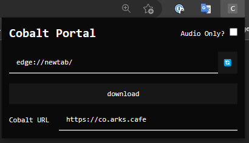

# cobalt-extension

- A chrome extension for [@wukko/cobalt](https://github.com/wukko/cobalt)
- Vite + React + TypeScript + TailwindCSS/DaisyUI
- Meant as a proof of concept. Will elaborate on eventually.

# Note

- This extension does not work with Cobalt instances that don't allow CORS requests, which include the official instance at [co.wukko.me](https://co.wukko.me).
  - Feel free to use the one I host at [co.arks.cafe](https://co.arks.cafe) when using this extension.
  - Preferrably use host a Cobalt instance locally when testing.

## Preview

## To-Do

- Image Picker.

## Development

- Run `pnpm watch` to build on filechange.
- Import built extension from `./dist` into Chrome via `chrome://extensions/` URL or for Edge `edge://extensions/`
